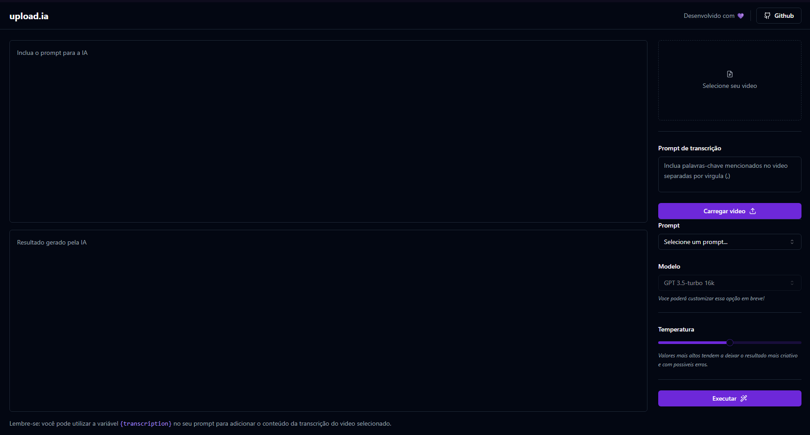

<h1 align="center">
  Upload.ia
</h1>

<h4 align="center">✅ Upload.ia ✅</h4>
 

## :information_source: Sobre o projeto:
Projeto da Next Level Week IA de 2023 na trilha Mastery da <a href="https://www.rocketseat.com.br">rocketseat</a>
 
### :information_source: Lembrando! 
A API utilizada nesse projeto está <a href="https://github.com/augustinho2/upload-ia-api"> aqui <a/>
 
### :information_source: Resumo do projeto:
Aplicação web onde você irá carregar um vídeo, uma IA vai transcrever esse vídeo para texto e, a partir disso, o usuário poderá usar de Prompts para pedir para a IA te dar ideias sobre o conteúdo do vídeo, como por exemplo: como “editar” diferentes tipos de vídeos, ideias de descrições, títulos para o youtube etc.
 
## :information_source: Imagem do projeto:

  

